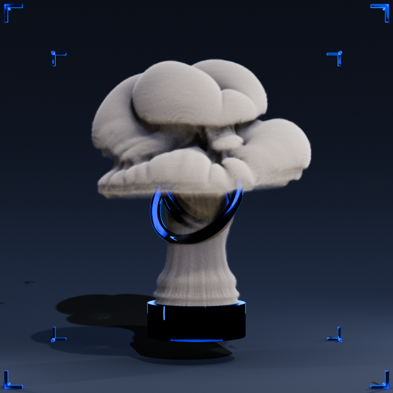
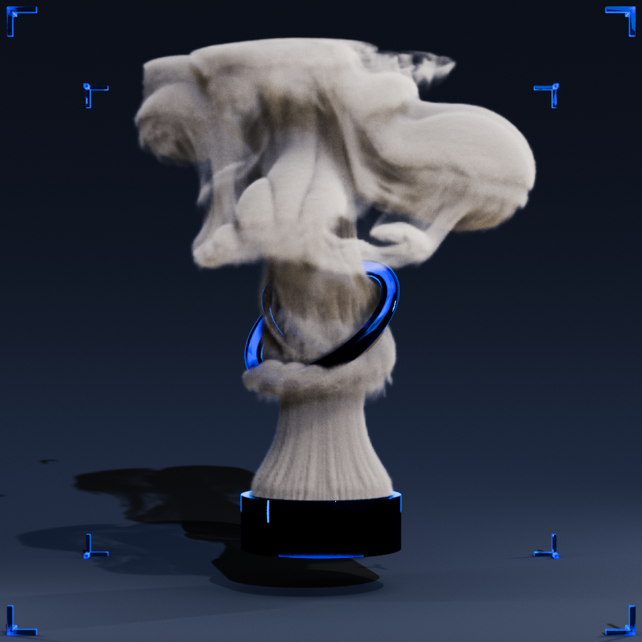
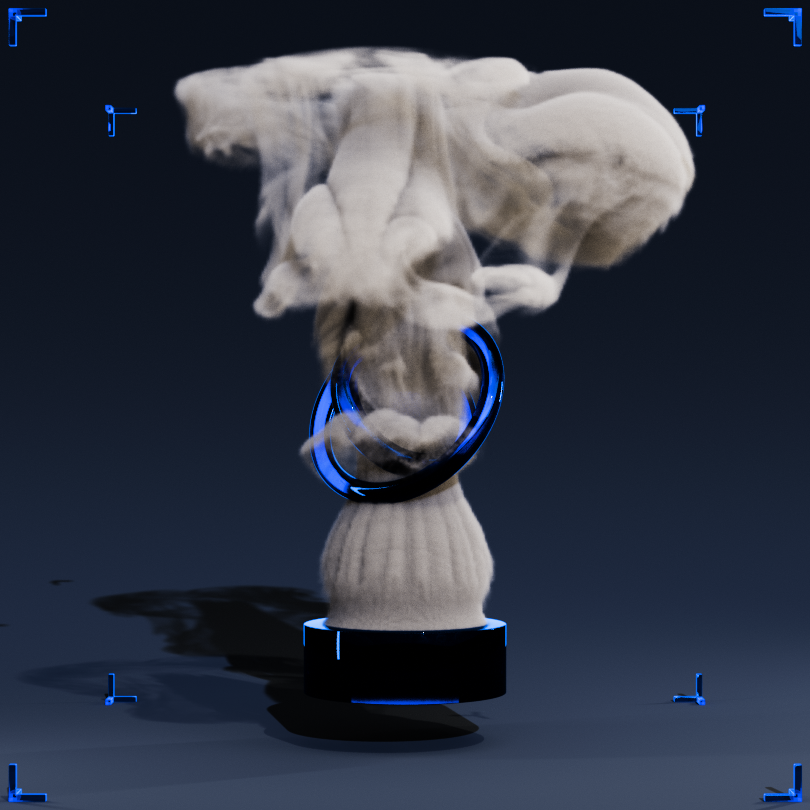

# Putzer Thomas Bachelor's Thesis

  <table>
    <tr>
      <td align="center">
         
      </td>
      <td align="center">
         
      </td>
      <td align="center">
         
      </td>
    </tr>
  </table>

This fork contains the code to my Bachelor's Thesis on "Higher-Order Mass- and Momentum-Conserving Advection for Fluid Simulations with Large Time Steps". Please refer to the attached PDFs for detailed information:
* [Thesis](docs/thesis.pdf)
* [Presentation](docs/presentation.pdf)

# Mantaflow

Mantaflow is an open-source framework targeted at fluid simulation research in Computer Graphics.
Its parallelized C++ solver core, python scene definition interface and plugin system allow for quickly prototyping and testing new algorithms. 

In addition, it provides a toolbox of examples for deep learning experiments with fluids. E.g., it contains examples
how to build convolutional neural network setups in conjunction with [tensorflow](https://www.tensorflow.org).

For deep learning with fully differentiable fluid simulations, please check out our [phiflow framework](https://github.com/tum-pbs/PhiFlow).

More information on how to install, run and code with Mantaflow, please head over to our home page at
[http://mantaflow.com](http://mantaflow.com)

